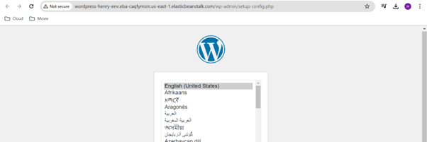
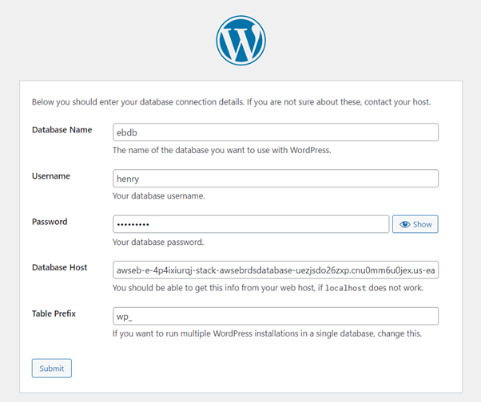
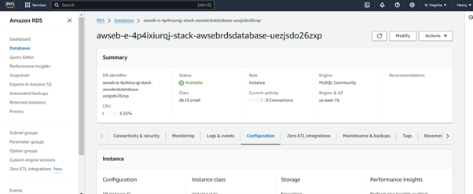
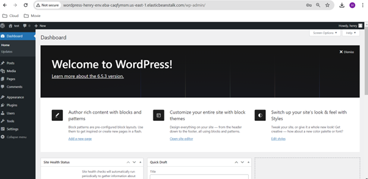

**Deploy a High-Availability WordPress Website with External Amazon RDS
Database using Elastic Beanstalk**

In this project we will be deploying a high-availability WordPress
website using AWS Elastic Beanstalk and an external Amazon RDS database
is an excellent solution for ensuring scalability, reliability, and
manageability. Elastic Beanstalk abstracts much of the infrastructure
management, allowing developers to focus on the application itself. By
leveraging Elastic Beanstalk and RDS, you can create a robust and
high-performing WordPress site that can handle variable traffic loads
efficiently.

1.  To launch a WordPress website using AWS Elastic Beanstalk, start by
    preparing your WordPress files. Download the latest version of
    WordPress from the official WordPress website. Once downloaded,
    extract the files on your local machine, ensuring all necessary
    files are present. Compress the extracted WordPress directory into a
    ZIP file, which will be used for deployment on AWS Elastic
    Beanstalk.

2.  Next, log in to the AWS Management Console and navigate to Elastic
    Beanstalk. Select the option to create a new application, providing
    a name and description for your application. Choose the PHP platform
    since WordPress runs on PHP. In the application code section, upload
    the WordPress ZIP file you prepared earlier.

Configure the environment settings, ensuring that you enable a database.
Elastic Beanstalk will automatically provision an Amazon RDS (Relational
Database Service) for you. Create a username and password for the
database, taking note of these credentials for later use. After
configuring the necessary settings, proceed to create the environment.
Elastic Beanstalk will set up the infrastructure, including EC2
instances, the database, and deploying your WordPress application. This
process might take a few minutes.

Once Elastic Beanstalk has finished setting up, you will be provided
with a link to your WordPress site, typically in the format
http://your-app-name.elasticbeanstalk.com. Open this link in your web
browser to access the WordPress setup page. Choose your preferred
language and proceed with the setup.

>  alt="A screenshot of a computer Description automatically generated" />

3.  Fill in the database connection details using the RDS information
    available in your AWS console. Enter the database name, username,
    password, and the RDS endpoint, then complete the remaining fields
    and submit. WordPress will check the database connection, and if
    everything is correct, it will prompt you to run the installation.
    Follow the on-screen instructions to complete the WordPress
    installation, setting your site title, admin username, password, and
    email.
    

> After the installation is complete, log in to your WordPress admin
> dashboard to begin customizing your site. Select a theme, install
> plugins, and add content as needed. Verify the deployment by
> navigating through your website to ensure all pages load correctly and
> the site functions as expected.
>
>  alt="A screenshot of a computer Description automatically generated" />

4.  By following these steps, you will have successfully launched a
    WordPress website using AWS Elastic Beanstalk. This method utilizes
    AWS's powerful infrastructure to handle the setup process, allowing
    you to focus on building and customizing your site.

