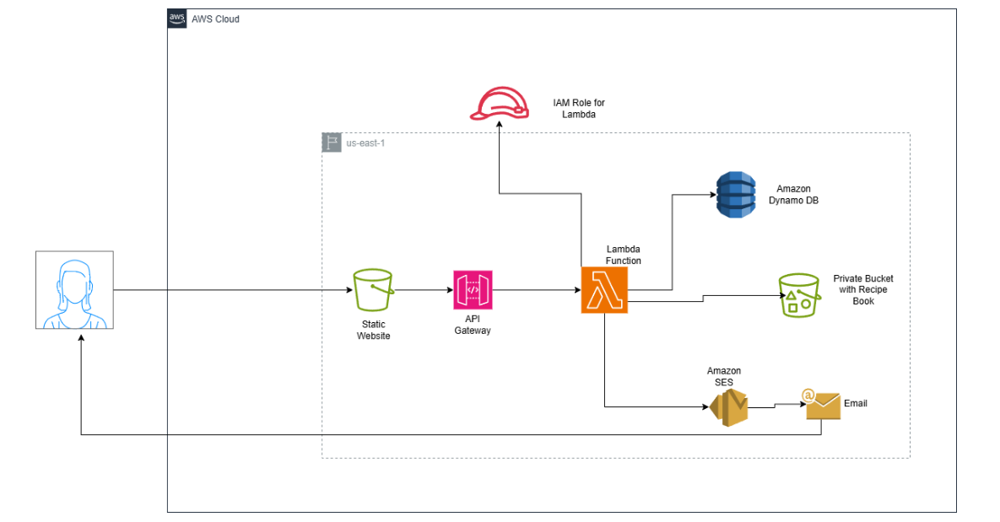
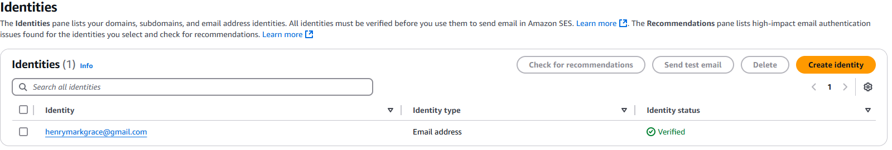
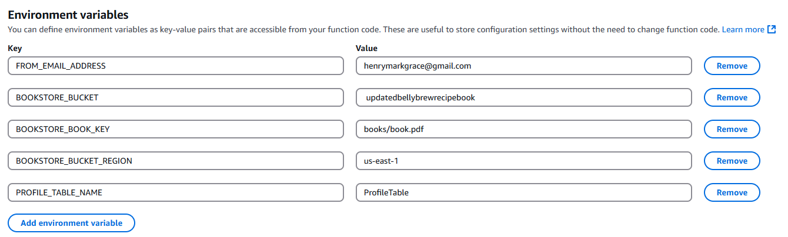
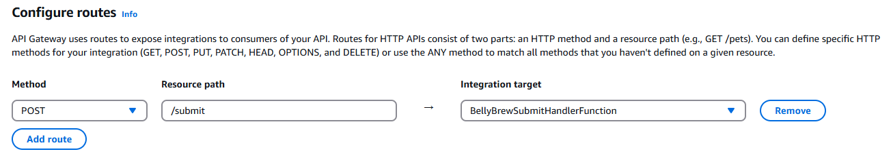
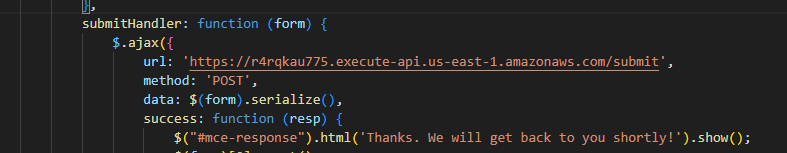
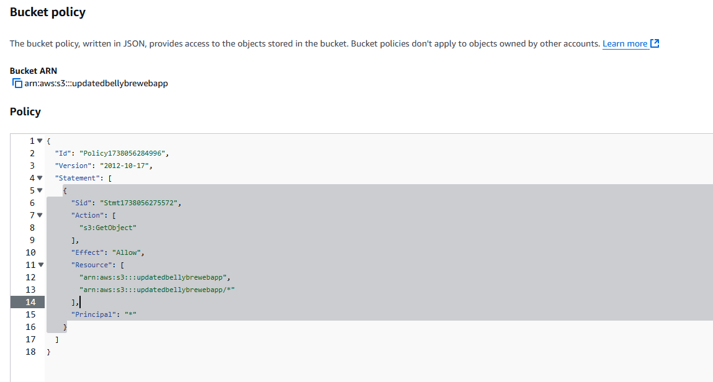
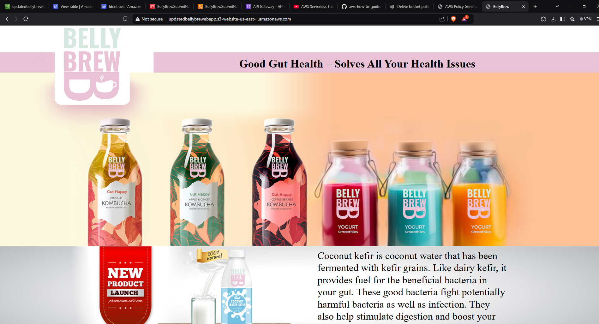

**Cloud Based e-book Delivery Solution**

The Requirements:

1.  Cloud solution that captures Email and Username from the customer.

2.  Host a website with a subscription form that asks visitors to sign
    up. In return, provide a gut-friendly recipe book. The email will be
    used for future marketing campaigns.

3.  Ensure the e-book is only available to genuine signups.

4.  Solution without any manual administration and management on
    servers.

{width="6.267716535433071in"
height="3.4305555555555554in"}

Frontend Website & Recipe Book Storage: **Static website and Book
Repository**

Compute services & Business Logic: **Lambda Function**

Database: **Dynamo DB**

**Steps**

1.  Create amazon S3 Bucket for recipe Book

    a.  Add book/book.pdf into s3 bucket.

2.  Create Dynamo DB table

3.  Configure SES

    a.  Create identity with email address

> {width="5.805564304461942in"
> height="0.9841021434820647in"}

4.  Define IAM Policy and IAM Role for AWS Lambda

    a.  Create Policy

    b.  Create a Role for Lambda service. Attach the role to the policy
        created.

5.  Create Lambda Function and Integrate the Role

    a.  Paste the code. Set the environment variables

> {width="5.262228783902012in"
> height="1.5863637357830271in"}

6.  Build HTTP API with API Gateway (when user clicked submit button)

    a.  We build http api. Take note of the invoke url

> {width="5.8370308398950135in"
> height="1.0295308398950132in"}
>
> {width="5.561968503937008in"
> height="1.0814599737532808in"}

7.  Create Amazon S3 Static Website Hosting

    a.  Upload the main files into the bucket

    b.  Even though we set it publicly accessible, we need to provide
        correct permissions.

> {width="4.2913681102362204in"
> height="2.3006791338582677in"}
>
> We used a policy generator in this case.

c.  Set this website as a static website hosting service.

<!-- -->

8.  Test Application

> {width="6.268055555555556in"
> height="3.39375in"}
