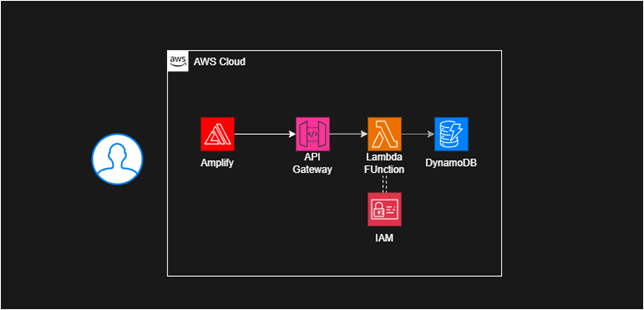
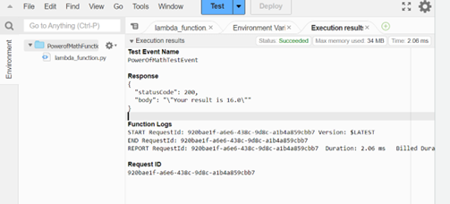
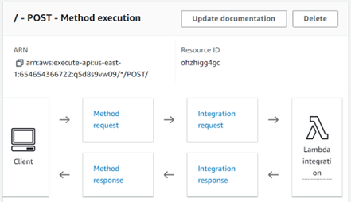
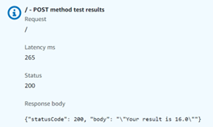
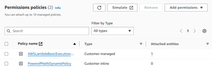
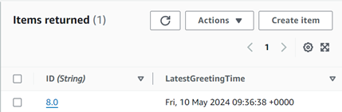
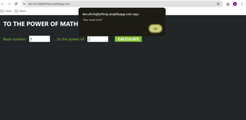

This project is about creating a web application that performs
mathematical operations. It involves hosting a webpage on Amazon
Amplify, implementing backend functionality using AWS Lambda for
calculations, utilizing API Gateway for interaction, storing data in
DynamoDB, and presenting the application through a user-friendly
interface.

1.  Firstly, our webpage finds a cozy home on Amazon Amplify, where we
    upload the "Index.html" file after zipping it up.

2.  Using AWS Lambda, we summon our Lambda function, now armed with
    updated code from "PowerOfMathFunction - Lambda-ORIGINAL," enabling
    it to perform mathematical operations. We ensure its functionality
    through a carefully configured test event.

3.  To activate our Lambda function, we need a public URL. Enter API
    Gateway! We choose a Rest API for this task.

API Gateway gets the green light to trigger our Lambda function. We also
enable CORS (Cross-Origin Resource Sharing) to allow our web
application, hosted on Amplify, to access resources across different
domains. After deploying the API, we run tests on the method body to
confirm its accuracy.

4.  Let's talk data storage! DynamoDB steps in as our lightweight,
    non-relational database of choice. We grant permissions for our
    Lambda function to write to this database. After creating our
    DynamoDB table, we give our Lambda function the green light to
    access it, thanks to the "add permission" option. The necessary JSON
    code is sourced from the "Execution Role Policy JSON" file.

Enhancements await! We update our Lambda function with the code from
"PowerOfMathFunction - Lambda-FINAL," allowing us to timestamp our data
entries. A sample of our DynamoDB data demonstrates this functionality.

5.  And with a simple refresh of our Amplify link, behold our Math
    Application in all its glory! Hooray!

