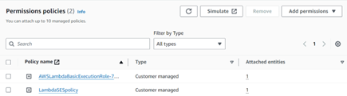
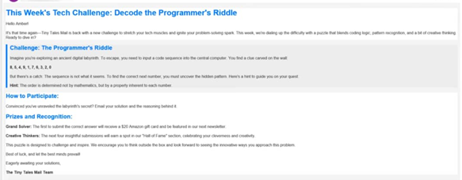
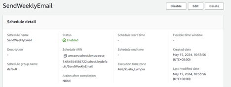

**Building an Email Marketing System on AWS**

This project involves creating a sophisticated email marketing system by
leveraging several AWS services. The goal is to automate the process of
sending personalized emails to a list of contacts using AWS Lambda,
Amazon S3, Amazon Simple Email Service (SES), Amazon EventBridge, and
AWS Identity and Access Management (IAM).

Here’s a comprehensive guide to the process:

**Step 1: Create an S3 Bucket and Upload Files**

The first step is to create an S3 bucket where you will store your email
template and the contact list.

1.  **Create an S3 Bucket**:

    - Open the AWS Management Console and navigate to the S3 service.

    - Create a new bucket, giving it a unique name.

2.  **Upload Files**:

    - Upload your HTML email template file (e.g.,
      **email_template.html**) to the bucket.

    - Upload your CSV file containing the contact list (e.g.,
      **contacts.csv**) to the bucket.

**Step 2: Set Up Identities in Simple Email Service**

Next, you need to set up and verify the email addresses that will be
used for sending emails through Amazon SES.

1.  **Verify Email Addresses**:

    - Open the Amazon SES console and navigate to the “Verified
      identities” section.

    - Verify the email address you intend to use as the sender. Follow
      the instructions provided by SES to complete the verification
      process.

**Step 3: Create a Lambda Function for Email Sending**

Now, you will create a Lambda function that reads the contact
information and email template from S3, personalizes the emails, and
sends them using SES.

1.  **Create a New Lambda Function**:

    - Open the AWS Lambda console and create a new function. Choose an
      appropriate runtime.

    - Upload the code provided in your "AWS Project - Email
      Marketing.txt" file. This code will automate the email sending
      process.

2.  **Lambda Function Logic**:

    - The Lambda function reads the contact list and email template from
      S3.

    - It personalizes the email for each contact by replacing
      placeholders in the template with actual contact details.

    - It sends the personalized emails using Amazon SES.

    - The function handles errors gracefully, logging any exceptions
      that occur.

**Step 4: Create an IAM Policy and Role for Lambda**

To ensure that the Lambda function can access the necessary resources
(S3 and SES), you need to create an IAM policy and attach it to a role
that the Lambda function will assume.

1.  **Create an IAM Policy**:

    - Open the IAM console and create a new policy that grants
      permissions to access S3 and SES.

    - 

2.  **Attach the Policy to a Role**:

    - Create a new role in IAM specifically for Lambda functions.

    - Attach the newly created policy to this role.

    - Assign this role to your Lambda function, ensuring it has the
      required permissions to execute its tasks.

**Step 5: Test the Lambda Function**

Before scheduling the function, it’s important to test it to ensure it
works correctly.

1.  **Invoke the Lambda Function**:

    - Manually invoke the Lambda function from the AWS Lambda console.

    - Monitor the logs to verify that emails are being sent
      successfully.

>  alt="A screenshot of a computer Description automatically generated" />

**Step 6: Schedule the Lambda Function Using EventBridge**

To automate the email sending process, you can schedule the Lambda
function using Amazon EventBridge.

1.  **Create a Rule in EventBridge**:

    - Open the Amazon EventBridge console and create a new rule.

    - Set the schedule for your rule, specifying when you want the
      Lambda function to be triggered (e.g., daily at a specific time).

    - 

2.  **Add Lambda Function as Target**:

    - Specify the Lambda function as the target for the EventBridge
      rule.

    - This ensures that the Lambda function will be triggered according
      to the schedule you set.

**Final Steps**

Ensure that all email addresses you intend to use (both sender and
recipients) are verified if your SES account is in the sandbox
environment. If needed, request production access to move out of the
sandbox mode.

By following these steps, you will have built a robust email marketing
system on AWS that can send personalized emails to your contacts based
on a predefined schedule. This system leverages the power of AWS
services to automate and streamline your email marketing efforts.
