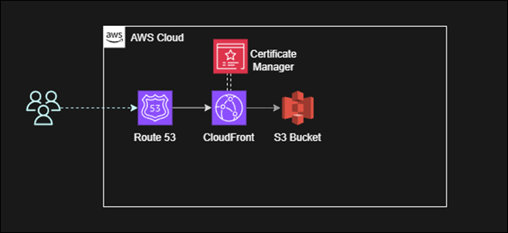
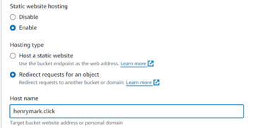
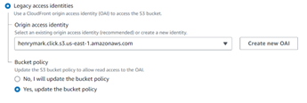
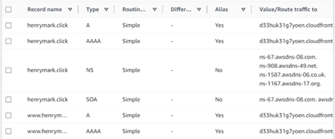
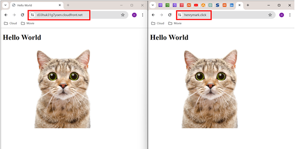

**Website hosting with S3, Route 53, Certificate Manager & CloudFront.**

1.  With the foundational elements in place, we proceed to create an S3
    bucket, which serves as the cornerstone of our architecture. During
    the creation process, we opt to restrict all public access, as our
    intention is to manage access through the CloudFront service. Within
    this bucket, we upload a simple HTML file that forms the basis of
    our website. We further enhance its capabilities by enabling static
    website hosting. Additionally, we create a secondary bucket with the
    www.henrymark.click domain, configuring it to redirect to our
    primary bucket under the henrymark.click domain, while ensuring the
    use of HTTPS protocol for enhanced security.

2.  With the foundational elements in place, we proceed to create an S3
    bucket, which serves as the cornerstone of our architecture. During
    the creation process, we opt to restrict all public access, as our
    intention is to manage access through the CloudFront service. Within
    this bucket, we upload a simple HTML file that forms the basis of
    our website. We further enhance its capabilities by enabling static
    website hosting. Additionally, we create a secondary bucket with the
    www.henrymark.click domain, configuring it to redirect to our
    primary bucket under the henrymark.click domain, while ensuring the
    use of HTTPS protocol for enhanced security.

3.  With the foundational elements in place, we proceed to create an S3
    bucket, which serves as the cornerstone of our architecture. During
    the creation process, we opt to restrict all public access, as our
    intention is to manage access through the CloudFront service. Within
    this bucket, we upload a simple HTML file that forms the basis of
    our website. We further enhance its capabilities by enabling static
    website hosting. Additionally, we create a secondary bucket with the
    www.henrymark.click domain, configuring it to redirect to our
    primary bucket under the henrymark.click domain, while ensuring the
    use of HTTPS protocol for enhanced security.

4.  To ensure seamless access to our website, we create records within
    the Route 53 Hosted Zone. Specifically, we create four distinct
    records that map the record names to the URLs obtained from the
    CloudFront distribution. This comprehensive setup enables users to
    access our website with or without the "www" prefix.

5.  With the meticulous completion of these steps, our website is now
    accessible through the desired link, marking the successful
    culmination of our configuration efforts.

